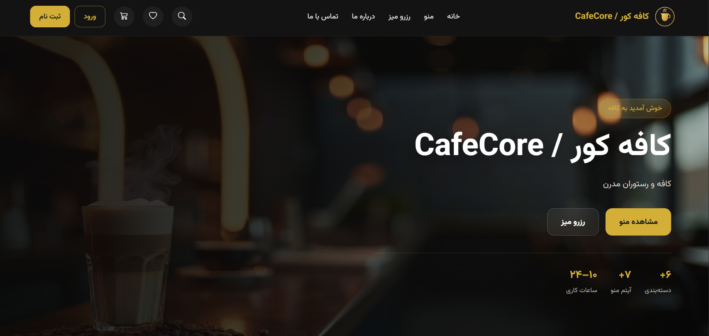
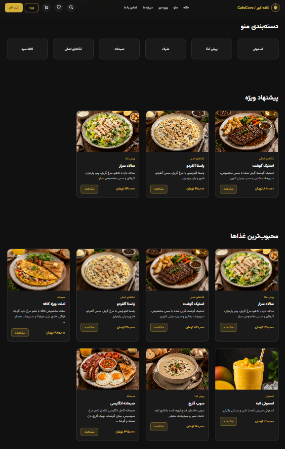
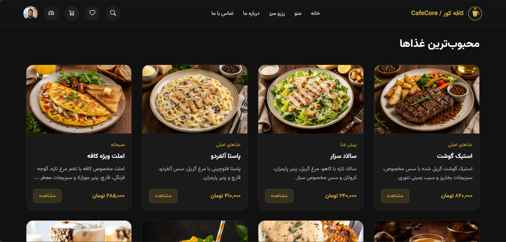
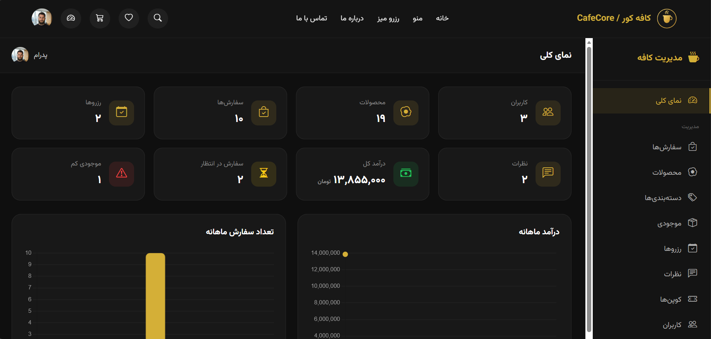
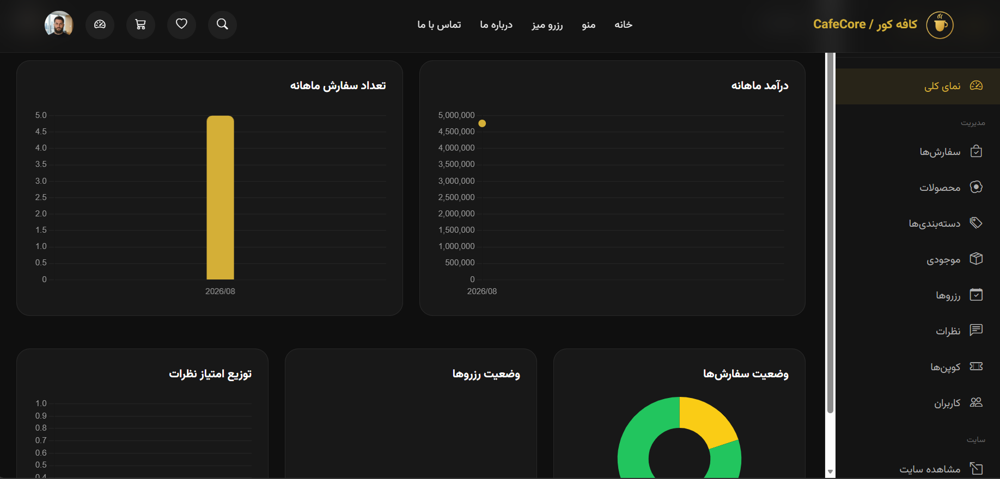
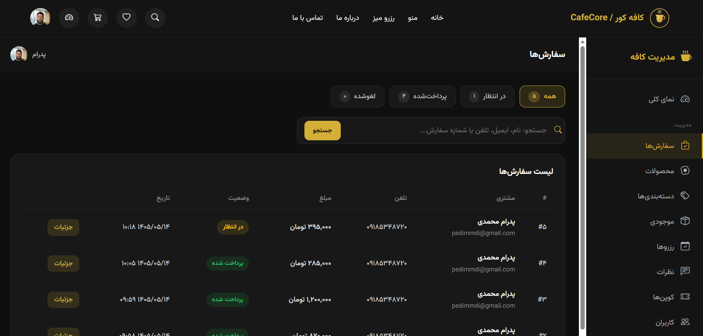

# CafeCore

A full-featured **cafe & restaurant management system** built with **Django 5**.

Includes menu, cart, orders, table reservations, reviews, favorites, and a complete staff dashboard with charts and CRUD for day-to-day cafe operations.

The UI is built with **custom HTML, CSS, and JavaScript** (no Bootstrap/Tailwind layout framework) — Bootstrap Icons and the Vazirmatn font are used for icons and typography only.


## About this project

I built CafeCore to practice a full multi-app Django workflow around a real business domain: catalog, cart, orders, reservations, reviews, and a staff-facing dashboard.

Along the way I focused on Persian UX (Jalali calendar, localized prices and digits), clear app boundaries, and a hand-written front-end without relying on a CSS framework. Payment is intentionally simulated so the emphasis stays on application logic and admin operations.

## Features

### Customer side
- Register / login / profile / password reset
- Product menu, categories, and search
- Session-based cart with coupon codes
- Order placement with simulated payment flow
- Table reservation with Jalali (Persian) calendar
- Reviews & ratings (admin approval required)
- Favorites list

### Admin dashboard (staff)
- Stats overview and Chart.js charts
- Manage orders, products, categories, and inventory
- Approve / reject reviews and reservations
- Coupon CRUD
- User management

## Tech stack

| Layer | Tools |
|--------|--------|
| Backend | Django 5.2, Python 3.11+ |
| Database | SQLite (default) or PostgreSQL |
| Frontend | Custom HTML, CSS, JavaScript |
| UI helpers | Bootstrap Icons, Vazirmatn |
| Persian dates | jdatetime, jalali-datepicker |
| Charts | Chart.js |
| Config | python-decouple |
| Containers | Docker, Docker Compose, Gunicorn, WhiteNoise |

## Quick start with Docker

Requires [Docker Desktop](https://www.docker.com/products/docker-desktop/) (or Docker Engine + Compose).

```bash
git clone https://github.com/pedimmdi/cafecore.git
cd cafecore
docker compose up --build
```

Then open:

- Site: http://127.0.0.1:8000
- Dashboard: http://127.0.0.1:8000/dashboard/
- Django Admin: http://127.0.0.1:8000/admin/

On first start the container runs migrations, collects static files, and seeds demo data (`RUN_SEED=1`).

Demo staff login (from seed):

- Email: `admin@cafecore.local`
- Password: `Admin123!`

Stop:

```bash
docker compose down
```

Reset database volume:

```bash
docker compose down -v
```

## Setup (local, without Docker)

```bash
git clone https://github.com/pedimmdi/cafecore.git
cd cafecore

python -m venv .venv
# Windows
.venv\Scripts\activate
# Linux / macOS
source .venv/bin/activate

pip install -r requirements.txt
cp .env.example .env
# Edit .env and set a SECRET_KEY

cd core
# Keep a copy of .env in this folder (python-decouple reads it from the working directory)
python manage.py migrate
python manage.py seed_demo
python manage.py runserver
```

- Site: http://127.0.0.1:8000
- Dashboard: http://127.0.0.1:8000/dashboard/ (staff user)
- Django Admin: http://127.0.0.1:8000/admin/

### Demo data

```bash
cd core
python manage.py seed_demo
```

This command creates:

- Sample categories and products
- Demo coupon code `DEMO10` (10% off)
- A superuser if one does not already exist:
  - Email: `admin@cafecore.local`
  - Password: `Admin123!`

Safe to run more than once (`get_or_create` — it will not duplicate the same records).

> Change the demo password after first login if you use this beyond local testing.

### PostgreSQL (optional)

In `.env`:

```env
DB_ENGINE=postgres
DB_NAME=cafecore
DB_USER=postgres
DB_PASSWORD=your_password
DB_HOST=127.0.0.1
DB_PORT=5432
```

Then run `migrate` again.

Default is SQLite (`DB_ENGINE=sqlite`) so the project runs without PostgreSQL.

## Tests

```bash
cd core
python manage.py test
```

## Project structure

```text
cafecore/
├── core/
│   ├── accounts/        # Auth & user profile
│   ├── menu/            # Products & categories
│   ├── orders/          # Cart & orders
│   ├── payments/        # Simulated payments
│   ├── reservations/    # Table reservations
│   ├── reviews/         # Product reviews
│   ├── favorites/       # Favorites
│   ├── dashboard/       # Staff dashboard
│   ├── pages/           # Home, about, contact (+ seed_demo)
│   ├── siteconfig/      # Site settings
│   ├── static/          # Custom CSS & JS
│   └── templates/       # Custom HTML templates
├── docker/
│   └── entrypoint.sh
├── docs/
│   └── screenshots/
├── Dockerfile
├── docker-compose.yml
├── requirements.txt
├── .env.example
├── LICENSE
└── README.md
```

## Screenshots

### Home







### Dashboard







## License

This project is licensed under the **MIT License** — see the [LICENSE](LICENSE) file for details.
